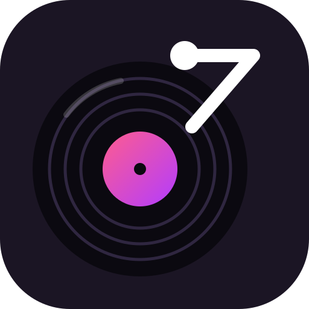

<p align="center"></p>

<h1 align="center">zKaraver</h1>

自架的多房間卡拉 OK 點歌系統。手機掃 QR code 點歌，電視或電腦上開播放頁。

- **點歌頁** `/r/<房間名稱>`：匿名加入（只需暱稱）、搜尋點歌、我的最愛、看佇列、刪自己的歌、切歌；輪到自己時可暫停、重唱、調音量、切換原唱／伴唱、隱藏 QR code
- **播放頁** `/r/<房間名稱>/player`：不需登入，打開就自動運作；先到先播，後開的排隊遞補。全螢幕播放、螢幕常亮、換歌前 5 秒預告、角落顯示 QR code 與下一首、待機時顯示大 QR code
- **管理頁** `/admin`：建立／刪除房間、查看與中斷播放端、佇列模式（依點歌順序／輪流制）、調整順序、踢人、每人點歌上限、閒置自動清空、演唱紀錄、重新掃描曲庫

## 部署

不需要原始碼。建立一個資料夾，放入下面這份 `docker-compose.yml`，把標示「改成你的」的三行改掉：

```yaml
services:
  zkaraver:
    image: ghcr.io/zoosewu/zkaraver:latest
    restart: unless-stopped
    ports:
      - "8080:8080"
    environment:
      # 改成你的：對外網址，QR code 會指向這裡（例如區網 IP 或反向代理後的網域）
      PUBLIC_URL: http://192.168.1.10:8080
      # 改成你的：管理頁密碼
      ADMIN_PASSWORD: change-me
      # 以下為選填，數值為預設值
      FILENAME_FORMAT: artist-title   # artist-title / title-artist / title
      FILENAME_SEPARATOR: " - "
      ORIGINAL_SUFFIX: ""            # 例如 _original，啟用原唱切換（見「曲庫」）
      MEDIA_EXTENSIONS: .mp4,.m4v,.webm
      GOMEMLIMIT: 64MiB
    volumes:
      # 資料庫（房間、佇列、紀錄），會自動建立在 compose 檔旁邊
      - ./data:/data
      # 改成你的：主機上的歌曲資料夾（唯讀掛載）
      - /path/to/karaoke:/media:ro
```

容器預設用 root 執行，所以 Docker 自動建立的 `./data` 可以直接寫入。如果想改用一般使用者執行，先建好資料夾並設定擁有者，再加上 `user:`：

```sh
mkdir -p data && sudo chown 1000:1000 data
```

```yaml
    user: "1000:1000"
```

```sh
docker compose up -d
```

如果比較想把設定放在 `.env`，也可以直接使用 repo 裡的 [`docker-compose.yml`](docker-compose.yml) 搭配 [`.env.example`](.env.example)：

```sh
curl -fsSLO https://raw.githubusercontent.com/zoosewu/zkaraver/main/docker-compose.yml
curl -fsSL https://raw.githubusercontent.com/zoosewu/zkaraver/main/.env.example -o .env
# 編輯 .env 後
docker compose up -d
```

接著開 `http://<主機>:8080/admin` 建立房間，再把電視接上（見「電視（播放端）設定」）。

**房間名稱就是網址**：例如建立 `living-room`，點歌頁就是 `/r/living-room`。名稱只能用英文、數字、底線 `_` 和橫線 `-`（最多 32 個字），不分大小寫（`KTV` 和 `ktv` 是同一個房間，網址打哪種都能連到），建立後不能改名。

更新到最新版：

```sh
docker compose pull && docker compose up -d
```

### 從 Karaver 升級

專案改名為 zKaraver，image 搬到 `ghcr.io/zoosewu/zkaraver`，compose 的服務名稱也改成 `zkaraver`。升級時換成新的 `docker-compose.yml`（或把 image 和服務名稱改掉），然後執行：

```sh
docker compose pull && docker compose up -d --remove-orphans
```

`--remove-orphans` 會移除舊名稱的容器。資料會自動搬過來：`./data/karaver.db` 在第一次啟動時改名為 `zkaraver.db`，手機上的暱稱、身分和主題設定會自動沿用，管理員也不用重新登入。

Image 放在 `ghcr.io/zoosewu/zkaraver`，支援 `linux/amd64` 和 `linux/arm64`（例如樹莓派、ARM 架構的 NAS）。可用的標籤：

| 標籤 | 內容 |
|---|---|
| `latest` | `main` 分支的最新版 |
| `1.2.3`、`1.2`、`1` | 發行版（推送 `v1.2.3` 這種 git tag 時產生） |
| `sha-abc1234` | 特定 commit |

要固定版本時，把 `image` 改成 `ghcr.io/zoosewu/zkaraver:1.2.3`；使用 `.env` 的話，則設定 `ZKARAVER_TAG=1.2.3`。

如果想從原始碼自己建置：

```sh
docker compose -f docker-compose.yml -f docker-compose.build.yml up -d --build
```

### 環境變數

| 變數 | 說明 |
|---|---|
| `PUBLIC_URL` | 對外網址，QR code 會指向 `${PUBLIC_URL}/r/<房間名稱>`（必填） |
| `ADMIN_PASSWORD` | 管理頁的密碼（必填） |
| `MEDIA_PATH` | 僅限 `.env` 版本：主機上的歌曲資料夾（必填） |
| `PORT` | 僅限 `.env` 版本：對外 port，預設 8080 |
| `FILENAME_FORMAT` | `artist-title`（預設）、`title-artist`、`title` |
| `FILENAME_SEPARATOR` | 歌手和歌名之間的分隔字串，預設 `" - "`。找不到分隔字串時，整個檔名會當成歌名 |
| `ORIGINAL_SUFFIX` | 原唱版檔名的後綴，留空表示不啟用，見「曲庫」 |
| `MEDIA_EXTENSIONS` | 要掃描的副檔名，預設 `.mp4,.m4v,.webm`（瀏覽器普遍能播的格式），見「曲庫」 |

用反向代理（Caddy、Nginx、Traefik）提供 HTTPS 時，`PUBLIC_URL` 要填代理後的網址。代理需要支援 WebSocket（路徑 `/api/rooms/*/ws`）。

Image 內建健康檢查（`/healthz`，同時檢查資料庫連線），`docker ps` 會顯示 `healthy` 或 `unhealthy`。

需要進容器查看狀況時（image 以 Alpine 為基底）：

```sh
docker compose exec zkaraver sh
# 例如：ls /media、ls -la /data，或 apk add sqlite 後執行 sqlite3 /data/zkaraver.db
```

### 曲庫

- 容器啟動時會自動掃描一次，之後新增檔案請到管理頁按「重新掃描」。
- 會掃描所有子資料夾，但資料夾結構不影響分類，只會解析檔名。名稱以 `.` 開頭的檔案和資料夾會被略過。
- **符號連結**：會跟隨指向檔案和資料夾的符號連結。循環連結不會造成無限掃描；兩個連結指向同一個資料夾時，只會列出一次。注意容器只看得到有掛載進去的路徑，連結的目標必須也在容器內：建議在歌曲資料夾裡使用**相對路徑**的連結，或者把連結目標用相同的絕對路徑一起掛載進容器（例如 `- /mnt/nas:/mnt/nas:ro`）。
- **副檔名**：系統不轉檔，影片直接交給瀏覽器播放，所以只列出瀏覽器普遍能播的 `.mp4`、`.m4v`、`.webm`。如果你的播放端瀏覽器能播 `.mkv`，可以用 `MEDIA_EXTENSIONS=.mp4,.m4v,.webm,.mkv` 加進來。副檔名只是初步篩選，例如 H.265 編碼的 `.mp4` 在部分瀏覽器上還是播不了，播不了的歌會自動跳過。
- 影片會以 HTTP Range 直接串流原始檔，不轉檔。請使用瀏覽器能播放的 H.264/AAC 格式；H.265 在部分瀏覽器上無法播放。
- **原唱／伴唱切換**：設定 `ORIGINAL_SUFFIX=_original` 後，`周杰倫 - 晴天_original.mp4` 不會出現在歌單裡，而是成為 `周杰倫 - 晴天.mp4` 的原唱版。播放這首歌時，點歌者或管理員可以在手機上切換成「原唱」：畫面維持伴唱影片，聲音改用原唱檔的音軌，兩者會持續對時（誤差超過 0.3 秒就自動校正）。**兩個檔案的時間軸必須一致**，否則歌詞和歌聲會對不上。每首歌開始時都會回到伴唱。

## 電視（播放端）設定

### 用配對碼連線（推薦）

1. 電視的瀏覽器打開 `http://<主機>:8080/tv`。這個網址很短，用遙控器輸入一次後可以設成書籤。
2. 電視上會顯示一組 4 位數配對碼。
3. 在手機上輸入配對碼，電視就會自動開啟該房間的播放畫面：
   - **房間還沒有任何播放端時**：點歌頁上方會直接出現配對欄，任何已加入的人都可以配對。
   - **房間已經有播放端時**：只有管理頁的「投放到電視」可以配對，新的電視會排在後面等候，避免客人把電視切走。

每次打開 `/tv` 都要重新配對；配對碼只在那個畫面開著的時候有效，用過一次就失效。

也可以直接打開 `http://<主機>:8080/r/<房間名稱>/player` 跳過配對，kiosk 模式（見下方）就是用這個網址。

### 自動播放與全螢幕

播放頁打開後會直接運作，不需要按任何按鈕。不過瀏覽器的安全規則規定，**有聲音的自動播放**和**全螢幕**都必須由使用者觸發，所以：

- **一般瀏覽器**：進入播放畫面後，**按一下遙控器的任一鍵**（或用滑鼠點一下畫面）。這一下會同時進入全螢幕並解鎖聲音，之後換歌都會自動播放。還沒全螢幕時，畫面上方會顯示提示。
- **完全不用碰（推薦給專用電視或電腦）**：用 kiosk 模式啟動 Chrome 或 Edge，開機後直接全螢幕自動播放：

  ```sh
  # Linux / 樹莓派
  chromium --kiosk --autoplay-policy=no-user-gesture-required http://<主機>:8080/r/<房間名稱>/player
  # Windows
  "C:\Program Files\Google\Chrome\Application\chrome.exe" --kiosk --autoplay-policy=no-user-gesture-required http://<主機>:8080/r/<房間名稱>/player
  ```

  Android 電視可以用支援自動播放設定的 kiosk 瀏覽器（例如 Fully Kiosk Browser）。

**螢幕常亮**：播放頁會優先使用 Wake Lock API。但這個 API 只能在 HTTPS 或 `localhost` 下使用，用區網 `http://` 開啟時，會改成在背景循環播放一段極小的靜音影片，避免螢幕休眠。如果電視本身有自己的省電或螢幕保護設定，還是建議關掉。

## 我的最愛

點歌頁的歌曲旁邊有 ☆，按下去就會加入「最愛」分頁。最愛清單**以暱稱為識別**（不分大小寫），換手機或換房間時，只要用同一個暱稱就會看到同一份清單。相對地，用了別人的暱稱也會看到別人的最愛。

## 佇列規則

- **依點歌順序**：先點先唱，管理員可以手動調整順序。
- **輪流制**：每輪每人唱一首；同一輪中，最久沒唱的人先唱。從輪流制切回依點歌順序時，會保留當下的順序。
- 同一首歌已經在佇列中（或正在播放）時，不能重複點。
- 搜尋會忽略大小寫、空白、標點符號和全形半形的差異：打「五月天倔強」、「倔強 五月天」或「ｑｕｅｅｎ」都找得到。空白分開的每個關鍵字都要符合。
- 音量和「顯示 QR code」平常只存在記憶體，正常關機（`docker compose down`、`restart`）時才寫入資料庫；如果容器被強制終止，會回到上次儲存的值。
- 任何人都能切歌。暫停、重唱、音量、原唱切換和電視上的 QR code 顯示，只有點歌者本人和管理員能控制。暫停、重唱、切歌按下後都會先確認。
- 佇列每首歌的「⋯」選單：**依點歌順序**模式下任何人都能把任何一首歌「向上一首」或「移到最上面」；**輪流制**下只能調整自己幾首歌之間的先後，不會插隊到別人前面。刪除只能刪自己點的歌，而且要確認兩次。
- 佇列分頁打開時，正在播放的歌會在最上方，往上滑可以看到演唱紀錄。演唱紀錄可以加入最愛，也可以「重唱」（以自己的名義再點一次）。
- 房間設定（⚙）的「全部重唱」：佇列清空、而且有演唱紀錄時可以使用，會把所有紀錄依原本的順序放回佇列，點歌者維持原本的人（重複的歌只加一次，已被踢出的人點的歌會略過），需要確認兩次。
- 播放端先到先贏：第一個連上的負責播放，之後開的會排隊並顯示順位。播放中的播放端斷線時，排第一位的會自動接手，從目前這首歌的開頭播起。管理員可以在管理頁中斷任何一個播放端；被中斷的播放端按「重新連線」後，會排到隊伍最後面。
- 「播完換下一首」只接受目前播放中的播放端回報，並用伺服器發給它的密鑰驗證。

## 開發

```sh
# 後端（需要 Go 1.26）
cd server && PUBLIC_URL=http://localhost:5173 ADMIN_PASSWORD=dev MEDIA_DIR=/path/to/songs DATA_DIR=./data go run .
# 前端（Vite 會把 /api、/media 轉給 :8080）
cd web && npm install && npm run dev
# 測試
cd server && go test ./...
cd web && npm run check
```

架構：Go（`net/http`、`coder/websocket`、純 Go 的 SQLite）+ Svelte 5，前端打包後嵌入 Go 執行檔，最終產出約 30 MB 的 Alpine image。房間狀態放在記憶體中，同時寫入 SQLite；有變動時透過 WebSocket 推送完整快照給所有連線。

介面文字放在 `web/src/lib/locales/`。要新增語言，複製 `zh-TW.ts` 後在 `web/src/lib/i18n.ts` 註冊即可。

## CI/CD

`.github/workflows/ci.yml` 的流程：

1. **測試**：每次 push 和 PR 都會執行 `gofmt`、`go vet`、`go test`、`svelte-check` 和前端建置。
2. **建置 image**：測試通過後建置 amd64 和 arm64 的 image。只有推送到 `main` 或推送 `v*` tag 時才會上傳到 GHCR，PR 只建置不上傳。

發行新版本：

```sh
git tag v1.0.0 && git push origin v1.0.0
```
